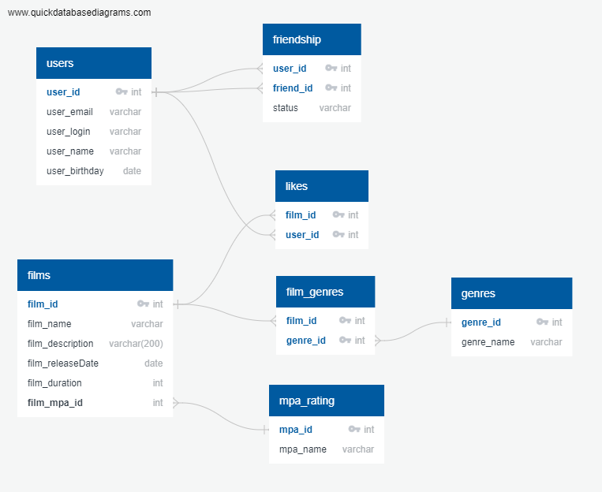

# java-filmorate
Template repository for Filmorate project.

## Описание структуры БД

1. Таблица **users** – содержит информацию о пользователях
   Таблица включает такие поля:
    - первичный ключ *user_id* – идентификатор пользователя
    - *user_email* – почта пользователя
    - *user_login* – логин пользователя
    - *user_name* – имя пользователя
    - *user_birthday* – дата рождения пользователя

2. Таблица **films** – содержит информацию о фильмах
   Таблица включает такие поля:
    - первичный ключ *film_id* – идентификатор фильма
    - *film_name* – название фильма
    - *film_description* – описание фильма
    - *film_releaseDate* – дата выхода фильма
    - *film_duration* – длительность фильма
    - внешний ключ *film_mpa_id* (ссылается на таблицу mpa_rating) – идентификатор MPA рейтинга фильма

3. Таблица **mpa_rating** – содержит информацию о рейтинге MPA
   Таблица включает такие поля:
    - первичный ключ *mpa_id* – идентификатор рейтинга MPA
    - *mpa_name* – обозначение рейтинга

4. Таблица **genres** – содержит информацию о жанрах фильмов
   Таблица включает такие поля:
    - первичный ключ *genre_id* – идентификатор жанра
    - *genre_name* – название жанра

5. Таблица **friendship** – содержит информацию о том, какие пользователи являются друзьями
   Таблица включает такие поля:
    - *user_id* (ссылается на таблицу users) – идентификатор пользователя
    - *friend_id* (ссылается на таблицу users) – идентификатор друга
    - *status* – описание статуса

6. Таблица **film_genres** – содержит информацию о том, какими жанрами описывается фильм
   Таблица включает такие поля:
    - *film_id* (отсылает к таблице films) – идентификатор фильма
    - *genre_id* (отсылает к таблице genres) – идентификатор жанра

7. Таблица **likes** – содержит информацию о лайках, поставленных пользователями фильмам
   Таблица включает такие поля:
    - *film_id* (отсылает к таблице films) – идентификатор фильма
    - *user_id* (ссылается на таблицу users) – идентификатор пользователя

